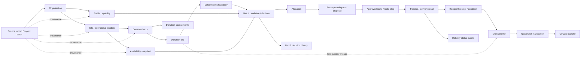

# FoodFlow database design research

> 文件性質：database design 的研究與 scope 建議，不是已批准的 schema，也不是 implementation plan。
> 更新日期：2026-08-09
> 產品邊界：KiwiHarvest driver 是 primary user；系統協助他把經驗證 donor site（包括 Woolworths 與 community organisation）的可分流食物送到合適的 recipient organisation site。Driver 確認一般 match / route；food-safety hard block 不可 override，高風險或 exception 交由 coordinator，recipient 另行 accept / decline。

## 先講結論

建議採用 **MVP-first + stable domain core**：

1. 先設計 MVP 真正要完成的一條資料流程，而不是先把所有預期功能的資料表都建出來。
2. 但 MVP 的核心 domain 不要做成一次性 demo schema。現在就要固定的部分包括：組織與實體地點的分離、食物供應批次與明細、接收方的能力與當下 availability、match / allocation、community onward redistribution lineage、agent route proposal、配送執行、狀態歷史、資料來源與時間。
3. 預期會固定、但尚未進入 MVP 的功能，不需要先建立完整資料表；只要避免現在的資料模型阻塞未來擴充即可。
4. 尚未驗證的資料不要用看似完整的欄位假裝成事實。尤其是 public address 是否為實際收貨入口、recipient 的即時 capacity、StoreCentral integration contract、food condition vocabulary、onward redistribution rule，以及 live traffic / weather provider contract，都應標記為未確認。

換句話說：**先做小的 operational schema，但把不容易變動的 business boundaries 設計正確；不要先做大的 future schema。**

## 1. 這個 project 的 database design 和課堂作業有什麼不同

課堂上的 database design 通常先回答「有哪些 entity、欄位和 relationship」。Project database design 還要回答「這筆資料是誰提供的、何時有效、誰能改、改變後能否追溯，以及它會不會被用來做現實世界的決策」。

| 課堂常見問題 | Project 中還需要補上的問題 | 對 FoodFlow 的影響 |
| --- | --- | --- |
| 有哪些 entity？ | 哪些是穩定的 master data，哪些是會隨時間改變的 operational fact？ | `organisation`、`site`、`capability` 不應和當下 capacity 混成同一筆資料。 |
| entity 如何關聯？ | 關聯的有效期間和驗證狀態是什麼？ | 一個 organisation 可以有多個 site；一個 site 可能先是 public candidate，之後才被 operator 確認。 |
| 欄位要不要 `NULL`？ | 缺值是「不知道」、「不適用」、「尚未同步」還是「沒有」？ | `capacity` 沒有值不能直接解讀成 capacity 為零。 |
| 正規化到什麼程度？ | 哪些值要可搜尋、排序、加 constraint，哪些才適合保留原始 payload？ | match 需要用的 food category、quantity、storage requirement 不應只放在 JSON。 |
| 資料表能不能存進去？ | 匯入重跑會不會產生重複資料？ | Donor / recipient 匯入需要 source identity、import batch 和 idempotency。 |
| 目前狀態是什麼？ | 狀態改變後是否要保留歷史，能否回答「當時為什麼這樣 match」？ | 不能只覆寫 donation 的 current status；需要 status event、match decision 和資料時間。 |
| 先把所有功能想好？ | 哪些未來需求已有證據，哪些只是可能性？ | voice-to-text、fleet telemetry、forecasting 不應因為「以後可能會有」就進入 MVP schema。 |

### 這份文件使用的證據標籤

- **`evidence-validated`／已由證據驗證**：已從 repository、Notion brief / features 或公開主要來源確認；也包含已被反例明確否定的假設。
- **`human-aligned`／人類已對齊**：使用者在目前討論中已明確決定，但不代表 KiwiHarvest 或 Woolworths 的真實營運流程已被外部資料驗證。
- **推斷／提案**：根據 brief、研究和 project scope 提出的設計建議。
- **`unresolved`／未確認**：只能由 product owner、KiwiHarvest、Woolworths 或 recipient operator 決定，不能直接固化成 schema rule。

## 2. 目前已知的 project boundary

### 2.1 Repository 現況：已確認

目前 repository 是空的 platform foundation：

- backend 目前只有 `/health` endpoint。
- PostgreSQL connection 只做連線檢查。
- 沒有 business tables、SQLAlchemy models、migrations 或 seed data。
- frontend 目前只顯示 platform foundation 與 backend/database health。

這代表現在不是在既有 production schema 上做增量修改，而是在建立第一個 business data model。任何 table name、API contract 和 workflow 都仍然是提案，不能寫成「目前已經存在」。

證據：[`README.md`](../README.md)、[`backend/app/main.py`](../backend/app/main.py)、[`backend/app/database.py`](../backend/app/database.py)、[`frontend/src/app/page.tsx`](../frontend/src/app/page.tsx)。

### 2.2 目前產品方向：已對齊／提案

目前已 `human-aligned` 的 primary user 是 KiwiHarvest driver。Driver 需要知道：

1. 哪些已驗證 donor site（Woolworths 或 community organisation）有可分流的食物。
2. 哪些 recipient organisation site 能在期限內接收。
3. 先依 food safety、food condition、保存條件、需求、capacity、時間窗和 location policy 排除不可行對象，再由 agent 依時效、需求、即時交通、天氣／道路風險、配送效益與路程成本排序。
4. Driver 確認一般 match / route；food-safety hard block 不可 override，高風險或 exception 交 coordinator；recipient 另行 accept / decline。
5. Community organisation 收到後若有安全且可追溯的剩餘食品，可以建立新的 onward offer，重新 match 到另一個 verified community organisation；不能改寫原 donation 的 recipient 或收貨歷史。

因此，第一版 database 的 primary subject 應該是 **supply-to-recipient-site、bounded redistribution 與 driver route execution workflow**，不是 consumer profile system，也不是完整 fleet management system。

### 2.3 Research data 和 operational data 必須分開

現有 [`docs/research.md`](./research.md) 的研究結果指出：

- Auckland 研究範圍包含 Woolworths FY25 與 current-public 的候選點；使用者已對齊將它們都視為近配送點候選資料。
- 研究資料中有 61 個 store point、60 個 distinct candidate identity，且部分座標只是 public approximate point；這些數字不能直接解讀成同數量的 active route stop。
- KiwiHarvest 在 Auckland 的 operational branches、recipient organisation sites、實際收貨入口和即時 capacity 仍需要 operator confirmation。
- public address 不等於已驗證的 navigation / loading point。

所以建議至少區分兩種資料：

| 資料層 | 用途 | 能不能直接供 driver navigation / matching 使用 |
| --- | --- | --- |
| Research registry | 保存 FY25/current 候選點、來源、座標、驗證狀態和研究假設 | 不能，除非該點已被確認為 operational site |
| Operational registry | 保存已確認的 store、KiwiHarvest branch、recipient receiving site 及其當下狀態 | 可以，但仍要看座標精度、有效期和營運狀態 |

這是本 project 很重要的 database design decision：**不要用一個 `locations` table 把 research candidate、公開地址和可導航收貨點混成同一種資料。**

## 3. Scope 建議：三層資料範圍

### Layer 0：Research / reference registry

這層可以先放進資料庫，因為它能支援後續驗證和地圖研究，但它不是 MVP 的 live operational truth。

建議保存：

- public source record 和 source URL。
- source name / source date / observed time。
- candidate identity、organisation name、site name、address text。
- latitude / longitude、座標精度、geocoding method。
- `verification_status`，例如 `public_candidate`、`operator_confirmed`、`needs_review`、`protected_or_unknown`。
- FY25/current snapshot 的來源與版本。
- unresolved assumption 和最後驗證時間。

這讓 61 個研究點可以被保留，但不會誤用成 61 個可配送地點。

### Layer 1：MVP operational workflow

這是 schema 第一版應該真正服務的範圍。建議把 MVP 限定成一個可完整走完的 donation batch：

1. 一個已確認的 donor pickup site（Woolworths 或 community organisation）透過 structured form 建立 donation batch；barcode optional，CSV 只作 seed / test。
2. Donation 有可分流的 food lines、quantity / unit、storage requirement、food condition、安全期限或 deadline、pickup window。
3. 系統載入已確認的 recipient organisation sites。
4. 系統用 deterministic rules 先檢查 safety、condition、storage、current capacity、acceptance、receiving window、verified location、road passability 與 deadline feasibility。
5. Agent 只對可行候選做 priority / route proposal；nearest distance 只是低優先級效率因素或 tie-breaker，不是主要選擇規則。
6. Driver 確認一般 match / route；recipient 另行 accept / decline；food-safety hard block 不可 override，高風險或 exception 交 coordinator。
7. Donation item 和 recipient site 之間使用獨立 allocation 關係，不把 `recipient_id` 直接放在 donation 上。MVP 初始 allocation 採 single-recipient，不拆分同一 donation item；reservation 的建立時點仍待確認。
8. Community recipient 可把已收貨後的安全剩餘量建立為新的、連回原始 lot / receipt 的 onward offer。這是新的 custody / supply event，不是原 donation 的 split 或 recipient 改名。
9. Route proposal保存當次traffic、weather、road event、ETA、provider、有效時間、policy / input version；driver批准後才形成committed route。第一個delivery slice假設所需live inputs已取得，不定義provider outage、degraded fallback或automatic re-routing。
10. 第一個delivery slice先完成`listed → matched → accepted → collected → delivered`成功路徑。保留append-only status-event邊界，讓之後能加入decline / failure / manual-rematch行為，但現在不先猜failure fields或transition enums。

這是「可操作的 bounded agent-assisted point-to-point / multi-stop workflow」，不是全 fleet、多車多店的 global optimiser。MVP 不需要先知道卡車的即時 GPS 位置，也不需要先建立 vehicle telemetry model。

### Layer 2：明確延後的資料

下列功能可以保留為 future decision，但不應因為預期會出現就先加入 MVP 的完整 schema：

- consumer-level account、consumer voice request、個人需求 profile。
- voice audio、transcript、ASR confidence、語意抽取歷史。
- 即時車輛位置、車輛容量、driver shift、telematics。
- 全 fleet、多車多店的 global route optimisation，以及無人批准的 autonomous re-routing。
- Provider outage、degraded route fallback、failed delivery後的完整retry / rematch state machine。
- 需求預測、動態 pricing、carbon accounting。
- recipient reliability score、fairness optimisation、推薦模型訓練資料集。
- 完整通知中心、外部 partner API、StoreCentral event stream。

這不是說這些功能永遠不做，而是目前沒有足夠的已確認 workflow、source contract 或 acceptance criteria，先做會把假設固化成錯誤的資料結構。

## 4. MVP-first 和 future-fixed data 的判斷方法

不要用「這個欄位未來可能會用」作為建表理由。對每個資料概念用兩個問題判斷：

1. 這是 domain 中穩定且跨 workflow 都會存在的事實嗎？
2. MVP 是否需要用它做決策、保存結果或追蹤責任？

| 判斷結果 | 做法 | 例子 |
| --- | --- | --- |
| 穩定，而且 MVP 需要 | 現在設計並加上 constraint / history | `organisation`、`site`、`donation`、`quantity`、`status_event` |
| 不穩定，但 MVP 需要 | 設計成 snapshot / event，不要覆寫 master data | recipient 當天 capacity、今日營業狀態、當次 match eligibility |
| 穩定，但不在 MVP | 只保留清楚的 domain boundary 和 extension point，不建完整功能表 | future `vehicle`、consumer account、partner integration |
| 不穩定，但 MVP 需要 | 保存帶來源、觀測時間、有效期與 freshness 的 immutable snapshot | traffic ETA、road event、weather warning、route-input facts |
| 不穩定，而且不在 MVP | 暫不建模，先列為 research / decision gap | 長期 demand forecast、reliability score |
| 名稱或語意尚未確認 | 不要猜欄位定義；先做 assumption test | `capacity` 是箱數、公斤、冷藏格，還是時間窗內可接收量？ |

### 建議現在就固定的「骨架」

這些不是 future feature，而是為了讓 MVP 不會丟失資料語意：

- **Organisation 與 site 分開**：一個 organisation 可有多個 sites，也可同時扮演 donor、recipient、hub 或 food-rescue operator；role 不能由 organisation 名稱推導。
- **Stable capability 與 current availability 分開**：例如「能否接收 chilled food」是 capability；「今天還有 40 kg 冷藏 capacity」是 availability snapshot。
- **Donation batch 與 donation line 分開**：一批 donation 可能包含多種 food category、barcode、unit 或保存條件。
- **Match decision 與 allocation 分開**：推薦一個 recipient 不代表數量已預留；allocation 才表示實際分配的 quantity。
- **Current status 與 status history 分開**：畫面可以快速讀 current status，但 audit / debugging 要讀 event history。
- **Operational location 與 research location 分開**：同一 public candidate 經確認後，不能直接覆蓋原始研究證據。
- **Source identity 與 internal identity 分開**：外部 barcode、StoreCentral record id 或 partner id 不應直接當作本系統 primary key。
- **原始 supply 與 onward redistribution 分開**：第一個 recipient 收貨後的剩餘食品必須形成 linked child offer / transfer；不得修改原 recipient、原數量或原 custody event。
- **Route proposal 與 route execution 分開**：agent output 是可審核 proposal；批准、committed route、actual stop event 各自保留版本與 actor。

### 不建議現在預先固定的「未來功能」

- 不要先建立 `consumer_need`，除非 project owner 明確把「直接從 consumer 收集需求」放進 KiwiHarvest MVP workflow。
- 不要先建立 `vehicle_position`，因為目前 route 起點可以先用已確認的 KiwiHarvest branch；沒有 telematics source 時，這張表只會存假資料。
- 不要先建立全 fleet optimiser或 vehicle telemetry；MVP 只保存單一 driver / shift範圍內的 route planning run、proposal、批准版本、ordered stops和實際結果。
- 不要先把完整 prompt、embedding 或 chain-of-thought 當成核心 domain data。MVP 保存 agent 使用的 input snapshot、policy / model identifier、候選、reason codes、proposal version和人類決定，已足以 audit。

## 5. 建議的 MVP domain data map

以下是概念層級的 data map，不是已批准的 table schema：

### 5.1 Stable master data

| Concept | MVP 是否需要 | 設計重點 |
| --- | --- | --- |
| `organisation` | 是 | 代表 Woolworths、KiwiHarvest 或 community organisation；同一 organisation 可同時是 donor、recipient、hub，名稱變更不能產生另一筆 identity。 |
| `site` | 是 | 實際的 store、KiwiHarvest branch、warehouse 或 community service / receiving site；保存 site type、address、coordinates 和 verification state。 |
| `site_relationship` | 是 | 保存「誰與誰有什麼 operational relationship」，例如 donation source、KiwiHarvest branch、recipient或 hub relationship，避免把 role 硬編碼在名稱欄位。 |
| `food_identity` | 是，但要小 | 保存 category / description / optional barcode identity；barcode 不應成為所有食物都必須有的唯一識別。 |
| `capability` | 是 | 例如 accepted food category、storage type、dietary constraint、service area、regular receiving rule。 |

### 5.2 MVP operational facts

| Concept | MVP 是否需要 | 設計重點 |
| --- | --- | --- |
| `donation_batch` | 是 | 代表一次可分流 supply event；source site 可以是 Woolworths 或 verified community site，並保存 created time、pickup window、safety deadline、overall state。 |
| `donation_line` | 是 | 保存 food identity snapshot、quantity、unit、storage requirement、lot / date mark、current condition和 line-level eligibility facts。 |
| `food_condition_observation` | 是 | 在 listing / re-offer、pickup和 delivery handoff保存 condition、temperature（需要時）、actor、observed time和 exception；checkpoint細節仍待 owner決定。 |
| `availability_snapshot` | 是 | 保存某 recipient site 在某個時間點的 capacity、接受狀態、有效期間和資料來源；不要覆寫歷史 snapshot。 |
| `match_attempt` | 是 | 保存候選、被排除的原因、輸入版本和產生時間，讓「為什麼不是另一個 recipient」可以解釋。 |
| `match_decision` | 是 | 保存人類批准、拒絕、決定者、時間和理由；AI recommendation 不能直接等同 final decision。 |
| `allocation` | 是 | 保存某 donation line 分給哪一個 recipient site、多少數量、是否 reserved / released / fulfilled。 |
| `onward_offer` / `transfer_lineage` | 是，名稱待定 | 保存 community 收貨後的剩餘量如何形成新的 supply opportunity，並連回原 lot、receipt、current custodian和 quantity balance；不得覆寫原 donation。 |
| `route_planning_run` / `route_proposal` | 是，概念已確定 | 保存agent看見的allocations、traffic / weather / road-event snapshots、policy / model version、priority reasons與proposal version；provider outage / degraded status延後。Exact table split仍待Gate G。 |
| `route_plan` / `route_stop` | 是 | 保存 human-approved起點、pickup / delivery stop、順序、時間窗，以及 planned / approved / actual timestamps；先不建 vehicle telemetry或 global fleet optimiser。 |
| `status_event` | 是 | 保存狀態轉換、actor、時間、理由和關聯 record；current status 可以由它衍生或作為受 constraint 保護的 projection。 |
| `source_record` / `import_batch` | 是 | 保存來源、外部 id、raw reference、observed time、import time 和 reconciliation status。 |

### 5.3 MVP 不需要作為核心 domain 的資料

| 資料 | 為什麼先不做 |
| --- | --- |
| Consumer profile / voice transcript | 目前問題是 KiwiHarvest 送到 recipient organisation site；尚未確認直接 consumer demand 是需求來源。 |
| Full barcode catalogue | MVP 需要可追蹤的 food identity，但沒有證據顯示第一版能取得完整 Woolworths product catalogue 或所有 donation 都有 barcode。 |
| Fleet / driver telemetry | 目前可以用固定 KiwiHarvest branch 作為 route origin；沒有 fleet source contract。 |
| 長期 forecast / model-training dataset | 需要歷史量、模型目的和評估方式；MVP只保存當次 match / route inputs、reason codes和 human decision。 |
| Aggregated dashboard tables | 先從 donation、allocation、delivery 和 status events 查詢；等資料量和 KPI 穩定後再做 materialized view 或 summary table。 |

## 6. Project database 的核心 design thinking

### 6.1 Identity：不要把名稱、地址或 barcode 當成 internal identity

需要區分三種 identity：

1. **Internal identity**：本系統使用的 immutable id。
2. **External identity**：StoreCentral record id、partner id、GTIN / barcode 或 public source id。
3. **Human-readable identity**：organisation name、site name、address text。

原因是名稱會改、地址會被更正、同一個 barcode 可能對應不同包裝或 donation line，而且 public research row 不一定是 operational site。外部 id 應保留 unique constraint，但不應取代 internal relationship。

### 6.2 Organisation、site 和 receiving point：三者不要混成一個 recipient row

目前 matching 和地圖都需要「實際哪裡收貨」。因此資料模型應該至少能表達：

- organisation：法律／營運上的接收組織。
- site：該組織的具體分點。
- receiving point：該 site 的實際交付入口或可導航位置。

`receiving point` 是否需要獨立 entity，要等 operator 確認一個 site 是否可能有多個入口；但至少要保留「公開地址」與「已確認的交付位置」不同的 status / precision。這比只放一個 `recipient_address` 安全，也符合前一份 research 對 public address 的限制。

### 6.3 Stable capability、availability 和 reservation 是三種不同資料

以冷藏 capacity 為例：

- `capability`：這個 site 一般能否接收 chilled food。
- `availability_snapshot`：在 2026-08-09 14:00，這個 site 回報還能接收多少。
- `allocation / reservation`：這一批 donation 已經占用了多少 capacity。

若三者都放在 `recipient.capacity`，系統會無法回答「當時可接收多少」和「哪一批貨占用了 capacity」。capacity 也不能只用一個 numeric 欄位，必須先確認 unit、storage class、time window 和是否可以 partial allocation。

### 6.4 Facts、decision 和 events 要分離

一個 donation 的原始事實、系統的候選排序、人的批准、driver 的實際配送結果，責任不同、時間也不同：

| 資料類型 | 例子 | 是否可覆寫 |
| --- | --- | --- |
| Fact | donation quantity、pickup window、recipient capability | 只有收到更正時更新；原始來源仍要保留 |
| Snapshot | 今日 capacity、今日營業狀態 | 新 snapshot 不應刪除舊 snapshot |
| Decision | human approved recipient A | 不應用新的 recommendation 覆蓋已作出的 decision |
| Event | First slice：accepted、collected、delivered；future：failed等 | append-only為主；failure-specific event types與reason contract延後 |

這個分離能避免 AI 重新推薦一次，就把之前的人類批准和 operational history 覆寫掉。

### 6.5 每個重要欄位都要有 source 和 time semantics

在 schema plan 中，每一個會影響 matching 或 routing 的欄位都應回答：

- `source`：誰提供？public research、Woolworths、KiwiHarvest staff、recipient operator 還是 system calculation？
- `observed_at`：資料代表什麼時間點？
- `recorded_at`：系統什麼時候收到？
- `valid_from` / `valid_until`：何時有效？
- `verification_status`：是否已被 operator 確認？
- `supersedes`：是否修正上一筆來源資料？

這是 temporal data 的最低限度思考：資料「何時在現實中有效」和「何時被系統記錄」可能不同。這在 capacity、地址、營業時間和 FY25/current status 尤其重要。

### 6.6 Barcode 是有用的來源欄位，不是整個 food model

如果 Woolworths 的實際匯入資料能提供 barcode，MVP 應保存：

- 原始 barcode / GTIN。
- source system 和 source record id。
- product description / category snapshot。
- quantity 和 unit。
- storage requirement、use-by / best-before 或 safety deadline。

但不能假設「有 barcode 就知道 donation 是否可分流」。散裝蔬果、烘焙品、已開封食品、熟食或同一批不同保存條件的食物，都可能需要人工輸入或 line-level override。因此 barcode 應是 identity / traceability 的一部分，而不是 eligibility 的唯一來源。

### 6.7 JSONB 只放來源特有或暫時未定型的 payload

MVP 中會被 filter、sort、match 或 constraint 使用的欄位，應該有明確的 relational column，例如 quantity、unit、storage requirement、deadline、capacity 和 coordinates。來源 API 的原始欄位、未定型 metadata 或 raw extraction result 才適合放在 JSONB。

PostgreSQL 文件指出 `jsonb` 會以可處理和可索引的分解格式保存 JSON，但不保留原始文字順序、whitespace 或 duplicate keys；因此它適合 raw payload 的查詢，不適合把所有 domain 欄位丟進一個 JSON 欄位後再靠 application code 解釋。[PostgreSQL JSON Types](https://www.postgresql.org/docs/current/datatype-json.html)

### 6.8 Community onward redistribution 是新的 custody event，不是改 recipient

NZ Food Network 的公開流程顯示，Food Hubs 會把收到的 food 再提供給較小的 community organisations；當 hub 無法保存整批 bulk donation時，也會保留自己能處理的數量，讓 network 分配其餘部分。這證明多階段 redistribution 是真實 domain，而 recipient 不一定是 supply chain 的永久終點。[NZ Food Network — About us](https://www.nzfoodnetwork.org.nz/about-us/)；[NZ Food Network — Our Food Hubs](https://www.nzfoodnetwork.org.nz/our-food-hubs/)

Database 上不能把原 donation 的 recipient A 改成 B。若 A 收到 20 kg、使用 13 kg後把 7 kg交給 B，原始 20 kg → A 的 receipt仍然成立；A → B必須是另一個 linked offer / allocation / transfer。最低需要保存：

- 原始 food lot / donation line 與 A 的 receipt。
- A 成為 current custodian 的時間和收到數量。
- consumed、disposed、reserved、transferred等 quantity movement，確保 onward quantity不超過可用 balance。
- Re-offer當下的 condition、date mark、label、storage和 temperature facts。
- 新的 match、human decision、recipient acceptance、pickup / delivery和 custody handoff。
- Recall可以從原 lot找到 A、B及後續所有 downstream recipients。

MPI要求 recalled food和 expired use-by food不得捐贈；對安全有影響的 storage / handling information需要交給 receiver。Food recall guidance也要求依 production、inventory和distribution records找出受影響 batches及所有去向。這支持每次 onward handoff保存 lineage和當下 condition，而不是沿用第一次 match的 safety結論。[MPI — Donations of food from commercial sources](https://www.mpi.govt.nz/dmsdocument/3783/send)；[MPI — Food recall guidance](https://www.mpi.govt.nz/food-business/food-recalls/food-recall-guidance-for-businesses)

證據只能確認「需要多階段 custody / traceability」，不能替 product owner決定 table名稱、最多轉幾手、是否只允許 verified partners，或「換」是否包含 barter。這些仍是 `unresolved`。

### 6.9 Match 與 route 必須先做 feasibility，再做 priority

「最近」不是完整 match policy。應先把 deterministic hard constraints與 agent ranking分開：

| 層級 | 例子 | 誰負責 | 結果 |
| --- | --- | --- | --- |
| Food eligibility | recall、expired use-by、missing critical facts、temperature / packaging / condition | Deterministic rules + manual-review policy | `eligible`、`hard_blocked`或`manual_review`；agent不可 override |
| Recipient feasibility | capability、need fit、fresh capacity、acceptance、receiving window、verified / protected location policy | Deterministic rules | 不可行對象不進 agent可選集合 |
| Route feasibility | pickup-before-delivery、official full closure、vehicle / road restriction、traffic-aware ETA能否滿足 safe deadline與 receiving window | Deterministic validator | 不可 commit的 route被排除 |
| Priority / optimisation | deadline slack、window tightness、condition / perishability risk、recipient need與 impact、weather / road risk、live congestion、travel time、distance、fairness | Agent在已通過 hard constraints的集合中排序 | 產生可解釋 proposal，不直接改 allocation或開始配送 |
| Authority | 一般 proposal、exception、recipient response | Driver確認；高風險交 coordinator；recipient accept / decline | 批准後才成 committed route |

OR-Tools與 Google Route Optimization都要求產品先明確提供 capacity、time window、pickup / delivery、precedence與 cost / penalty；optimizer只會優化被定義的 objective，不能自己知道 KiwiHarvest所說的「對的人」是什麼。[Google OR-Tools — Vehicle routing](https://developers.google.com/optimization/routing)；[Google Route Optimization — Costs](https://developers.google.com/maps/documentation/route-optimization/concepts/costs)；[ShipmentModel](https://developers.google.com/maps/documentation/route-optimization/reference/rest/v1/ShipmentModel)

因此，目前可先確認的 policy順序是：

1. Food safety與法律／policy hard blocks。
2. Recipient capability、acceptance、fresh capacity和 location permission。
3. Pickup / receiving window、safe deadline與 road passability。
4. Food urgency、condition / cold-chain risk、recipient need與配送 impact。
5. Current weather、official warnings、road events與 live traffic對風險、ETA和 slack的影響。
6. Total travel time、route stability與 operational workload。
7. Distance只作較低優先級 efficiency factor或 stable tie-breaker。

第4至第7項的相對權重是產品 policy，不是外部資料能自動決定；需要 owner在下一輪選擇。

### 6.10 Traffic、weather 與 road events 是 time-bounded route-input snapshots

Google Routes可用 current / historical traffic產生 traffic-aware duration，也能區分 traffic-aware duration和 static duration；NZTA公開 current traffic、incidents、roadworks與 closures；MetService是 New Zealand官方 severe-weather warning來源。這些證明 live inputs存在，但不證明本 project已取得 API credentials、commercial rights、field contract或 coverage SLA。[Google Routes — Traffic options](https://developers.google.com/maps/documentation/routes/traffic-opt)；[NZTA — Traffic and travel information](https://www.nzta.govt.nz/traffic-and-travel-information/)；[MetService Data](https://data.metservice.com/)；[MetService severe weather warnings](https://about.metservice.com/about-severe-weather-warnings)

不能把「今天下雨」或一個會被覆寫的 `current_traffic`欄位直接放在 delivery。每次 route planning run應引用不可變 input snapshot，至少回答：

- `provider` / `source_dataset` / provider record id。
- Observation、forecast、publication、fetch和route generation各自的 timestamp。
- `valid_from` / `valid_until`和本平台計算的 `fresh_until`。
- Planned departure time、traffic model / route preference。
- Traffic-aware ETA、static ETA、distance和 service-time assumptions。
- Road event / warning type、severity、affected area / segment和 passability interpretation。
- Coverage與用來判斷這筆input是否屬於當次route的有效時間。
- Matching、allocation、capacity、condition、location、policy、model與input version。

一般 congestion、rain或roadworks通常改變 cost、buffer與ETA；explicit full closure、official no-access restriction，或動態ETA已令 food超過 safe deadline / receiving window，才是 deterministic hard failure。哪些 severe-weather warning直接 no-go仍需 KiwiHarvest operational policy，agent不能自行創造禁止規則。

第一個delivery slice只要求在route proposal前取得一組有效input snapshot，並在driver確認前保存該snapshot；它不定義provider timeout、stale data、degraded route、active-route refresh或replan。這些不是靠現在先加幾個nullable failure fields就能完整決定的問題，因為未來可能牽涉新的event、route version、human decision或provider-health relationship。

因此本階段採用明確precondition：**只有required traffic / road / weather inputs已由測試fixture或可用provider提供時，才驗證成功路徑。** Provider失效時如何處理列入後續slice；不得在未定義前宣稱系統會自動fallback到nearest route。

## 7. PostgreSQL 層面的設計取向

這些是 database design principles，不是現在就要實作的 migration。

### 7.1 Constraint 應保護 domain invariant

應優先在 database 層保護不應被任何 API 繞過的規則，例如：

- internal id 和 external source identity 的 uniqueness。
- quantity 必須大於零。
- latitude / longitude 的合理範圍。
- allocation quantity 不能大於可分配 quantity；若跨多列計算，需決定由 transaction-level service 或 database constraint / locking 保護。
- status event 的 aggregate、from status、to status 和 actor 不可缺漏。
- FK 必須指向存在的 organisation、site、donation 或 recipient。

PostgreSQL 將 `NOT NULL`、`CHECK`、`UNIQUE`、`PRIMARY KEY`、`FOREIGN KEY` 等 constraint 視為資料完整性的正式機制；不要只靠 frontend validation。[PostgreSQL Constraints](https://www.postgresql.org/docs/current/ddl-constraints.html)

### 7.2 Import 要可重跑、可對帳

不論來源是 barcode CSV、StoreCentral export 或 partner update，都應有：

- `import_batch`：一次匯入的 boundary。
- `source_record`：外部 record identity、raw payload reference、received time。
- source-specific unique key：例如 `(source_system, source_record_id)`。
- import result：created、updated、rejected、needs_review。
- 不因重跑同一份檔案而建立第二筆 donation 或 site。

PostgreSQL 的 `INSERT ... ON CONFLICT` 可以配合 unique / exclusion constraint 處理衝突，但真正的 business mapping 仍要在 schema plan 中定義清楚。[PostgreSQL INSERT](https://www.postgresql.org/docs/current/sql-insert.html)

### 7.3 Match approval 和 allocation 需要明確 transaction boundary

當 human approve 一個 match 時，至少需要一起處理：

1. 寫入 `match_decision`。
2. 建立或更新 `allocation`。
3. 寫入 donation / match status event。
4. 對 recipient availability 或 reservation 做一致性檢查。

如果這幾步分開成功，可能出現「畫面顯示 approved，但沒有 allocation」或「capacity 已扣除，但 match 沒有成功」的半完成狀態。PostgreSQL 預設 isolation level 是 Read Committed；這足以作為起點，但 capacity reservation 的 concurrency 行為要用實際 transaction test 驗證。[PostgreSQL Transaction Isolation](https://www.postgresql.org/docs/current/transaction-iso.html)

### 7.4 目前不要 partition

目前研究範圍是 Auckland 的 store 和 recipient candidate registry，repository 也沒有 business data volume。不要因為「未來可能很多 event」就先 partition 所有 tables。先用正常 relational tables 和 indexes，等實際 event volume、query pattern 或 retention requirement 證明需要時再 partition。PostgreSQL 文件也把 partitioning 定位在資料量很大、能從 partition pruning 或 maintenance 得到明確收益的情境。[PostgreSQL Table Partitioning](https://www.postgresql.org/docs/current/ddl-partitioning.html)

### 7.5 時間與座標要有明確語意

- 所有跨系統時間以 timezone-aware timestamp 保存；Auckland 的展示時間由 application layer 轉換。
- `expiry_at`、`pickup_window`、`receiving_window` 和 `observed_at` 不是同一種時間，不能只用一個 `date` 欄位。
- 座標要同時保存 precision / verification status；approximate public point 不應被視為 loading entrance。
- Route distance / duration 若是 system calculation，應保存 calculation time、provider 和 input version；不要把它當成永遠不變的 fact。

參考：[PostgreSQL Date/Time Types](https://www.postgresql.org/docs/current/datatype-datetime.html)。

## 8. 在 schema field freeze 前必須驗證的資料

以下問題會直接改變 cardinality、nullable、constraint 和 transaction design。Q1–Q8已有 owner alignment，但不代表所有 field contract都已完成；剩餘 material decisions未釐清前，只能保留 staged plan，不能凍結 migration。

| 優先級 | 必須驗證的問題 | 會影響什麼 |
| --- | --- | --- |
| P0 | Driver / coordinator / recipient response的 authority已對齊；actor contract、membership scope和 exception event如何表示？Auth / login實作可延後。 | user / actor、permission、decision history、API workflow。 |
| P0 | 一次 donation 是一個 batch還是每個 barcode item一筆？哪些 lot、date mark、temperature、condition或 unit差異必須拆 line？ | `donation_batch`、`donation_line`和 condition observation的 cardinality。 |
| P0 | MVP以 structured form為正式輸入、barcode optional；manual record的 external identity與 CSV seed/test provenance如何定義？ | import contract、nullable欄位、product identity、idempotency。Future StoreCentral不阻擋MVP。 |
| P0 | Recall / expired use-by hard block已對齊；哪些欄位算 critical、food condition vocabulary和 manual-review outcome是什麼？ | eligibility model、condition observation、reason code、audit。 |
| P0 | Capacity contract採 food / storage lane + quantity / unit + receiving window + `valid_until`；支援哪些 unit、誰可宣告 stale / correction？ | quantity model、unit conversion、availability、allocation。 |
| P0 | 初始 donation item採 single-recipient、不 split；reservation在 recipient accept、driver approval或其他時點建立／釋放？ | allocation lifecycle、locking、fulfilment、rollback。 |
| P0 | FY25/current全部保留為 research candidate，operator-confirmed point才能 routing，protected point限 assigned actor；exact reveal與audit規則是什麼？ | site、receiving point、precision、access control。 |
| P0 | Agent規劃一個job、單一driver planning session或全fleet？在required live snapshots已存在的成功路徑中，priority policy是什麼？ | route planning run、input snapshot、proposal、approval和route version。 |
| P0 | Community re-offer是否限 verified partners、是否只允許free donation、最多幾個 onward hops、每次要在哪些 checkpoints重驗 condition？ | organisation roles、supply lineage、quantity balance、transfer和 safety audit。 |
| P1 | recipient availability的 exact refresh / expiry SLA是什麼？operator不回覆時是 unknown、unavailable還是 stale？ | snapshot validity、matching exclusion rule。 |
| Deferred | Provider outage / stale live data、decline、failed pickup / delivery、reservation release、retry與manual rematch的exact behavior。 | 未來status events、reason data、route versions、custody和reservation lifecycle；不阻擋第一個成功路徑slice。 |
| P1 | FY25/current candidate registry 如何標記「研究候選」和「今日可用」？誰負責 review？ | research-to-operational promotion workflow。 |
| P1 | recipient organisation 是否可接收不同 food category、dietary restriction、temperature class？是否 site-specific？ | capability cardinality、matching filters。 |
| P1 | 是否需要通知、外部 API、CSV import 或完全手動輸入？ | source tables、outbox / integration boundary、MVP effort。 |
| P1 | 是否需要保存 consumer-level needs？如果需要，consumer 是匿名 aggregate demand 還是 identifiable person？ | privacy、consent、new scope；沒有明確答案前先不建。 |

### 需要做的 assumption tests

| Assumption | 測試方式 | 通過條件 |
| --- | --- | --- |
| Barcode 能代表完整 food identity | 取 chilled、fresh produce、bakery、prepared food、mixed batch 各一例，對照實際可用欄位 | 每一類都能保存必要的 category、quantity、unit、deadline 和 storage facts；不能做到時，barcode 只能是 optional identity。 |
| 一個 donation 可以只匹配一個 recipient | 用 recipient capacity 小於 donation quantity 的案例演練 | 若需要拆分，schema 必須支持多個 allocation，而不是把 recipient_id 放在 donation 上。 |
| Public address 就是 driver 可用位置 | 請 store / recipient operator 指出實際 pickup / receiving entrance | 若不同，必須把 public address、operational point、verification 狀態分開。 |
| Availability 等於固定 capacity | 請 recipient 提供同一 site 在不同日子的 capacity 例子 | 若會變，必須保存 snapshot / valid time；不能只存 profile.capacity。 |
| KiwiHarvest branch 是 route origin 就足夠 | 以一次 pickup、一次 delivery 的人工流程畫 route，確認是否有 cross-dock、回站或臨時起點 | 能用固定 branch + route stops 完成 MVP；否則再擴充 origin model。 |
| 所有研究候選點都能直接進 operational map | 抽樣核對 FY25/current、approximate、unknown 點 | 只有 `operator_confirmed` 且有足夠座標精度的點能進 navigation / live matching。 |
| 最近的 recipient就是「對的人」 | 建立近點無冷藏／容量、遠點符合urgent need，以及交通壅塞令近點錯過deadline的反例 | 先過hard feasibility；priority保存food urgency、need、capacity、weather / road risk、traffic ETA與travel cost理由，distance不得單獨決定結果。 |
| Community re-offer可以沿用原 donation | 演練A收到20 kg、使用13 kg、re-offer 7 kg，以及之後發生recall | 原receipt不改寫；7 kg形成linked child offer / transfer，每次handoff重驗condition，recall可遍歷所有downstream recipients。 |

Failure / outage案例仍是已知風險，但依owner最新scope不作為第一個delivery slice的acceptance tests。現在只保留status-event與route-version extension boundary；下一個slice再演練decline、failed delivery、provider outage與manual rematch。

### 8.1 三輪 assumption test 的方法與結果

本輪在 2026-08-09 依序跑了三次，不把同一個未驗證說法重複三次：

#### Loop 1 — 先用 project 原始材料找矛盾

讀取 repository、兩份 Notion 原始頁面、[`foodflow-mvp-feature-spec.md`](./foodflow-mvp-feature-spec.md)、[`research.md`](./research.md) 和現有 plan 後，得到以下邊界：

- Notion scenario brief 已確認 StoreCentral 在 2022 年已有 scan、diversion eligibility、hierarchy prompt、local partner alert 和 diversion tracking；新系統不應重新發明一套「Woolworths 掃碼系統」。
- Notion feature page 的 Must Have 是 structured donation listing、recipient profile、current need / capacity、AI recommendation、explanation、accept / decline、pickup / delivery coordination、status、deterministic food-safety rules 和 human approval。
- 同一 feature page 把 split donation放在 Should Have，把 route optimisation、API integration和 conversational input放在 future。Owner後續已明確把「bounded agent route priority」納入現在的產品方向，因此它覆蓋舊 feature page的 route scope；但不等於授權 full-fleet optimizer或 autonomous rerouting。
- 使用者已將 KiwiHarvest driver設為 primary user，並選擇driver確認一般match / route、coordinator處理高風險exception、recipient另行accept / decline。這解開了主要authority方向；auth / login與exact permission fields仍可延後到相應table設計。
- Repository 仍只有 platform foundation，沒有 business schema 或真實 payload 可反推欄位；文件中的 workflow 不能當作已實作 contract。

#### Loop 2 — 用主要公開來源驗證 domain facts

- GS1 New Zealand 只證明 Woolworths-brand fresh meat 在 North Island stores 使用可帶 lot、日期和 weight 的 2D barcode，並表示仍在往其他 fresh range 擴展；它沒有證明所有 waste food 都有同樣 coverage。[GS1 NZ — Woolworths 2D barcodes](https://www.gs1nz.org/member-stories/woolworths-nz-2d-barcodes)
- Kai Commitment 的 case study 證明 StoreCentral published workflow，但沒有公開 API、event schema、partner acceptance、completed pickup 或 downstream route contract。[Kai Commitment — Woolworths StoreCentral case study](https://kaicommitment.org.nz/mp-files/woolworths-store-central-case-study.pdf/)
- MPI 與 FSANZ 區分 use-by safety boundary 和 best-before quality boundary；donated food 仍要 safe and suitable，並帶有 receiver 維持安全所需的 handling information。這否定一個 generic `expiry_at` 或只靠 product category 判斷安全的做法。[MPI — Donations of food from commercial sources](https://www.mpi.govt.nz/dmsdocument/3783/send)；[FSANZ — Use-by and best-before dates](https://www.foodstandards.gov.au/consumer/labelling/dates)
- KiwiHarvest 公開資料支持 driver 收集／分發食物，以及透過 recipient organisations 而不是直接向公眾提供 food parcels；但沒有公開 match approval、vehicle assignment 或固定 route topology。[KiwiHarvest — Receive food](https://www.kiwiharvest.org.nz/receive-food)；[KiwiHarvest — Volunteer](https://www.kiwiharvest.org.nz/volunteer)
- NZ Food Network 將 capability、bulk handling、storage type、community reach 和當下可處理的 donation volume分開，也明確描述 hub 可能無法存下整批 donation。這否定 annual throughput 等於 live capacity。[NZ Food Network — Our Food Hubs](https://www.nzfoodnetwork.org.nz/our-food-hubs/)
- NZ Food Network也明確描述Food Hubs再把donated food分給community groups，支持community-to-community onward redistribution；這要求每一手保留custody和lot lineage，但不指定本project的table名稱或轉手上限。[NZ Food Network — About us](https://www.nzfoodnetwork.org.nz/about-us/)
- Business.govt.nz 證明 KiwiHarvest 使用 EROAD 追蹤 fleet 並選較直接路線；這證明 fleet data 在現實中存在，不代表此 project 有權存取，也不表示 MVP 要複製 EROAD。[Business.govt.nz — KiwiHarvest](https://www.business.govt.nz/operations/running-a-sustainable-business/kiwiharvest)
- Google Routes、NZTA與MetService證明traffic-aware ETA、road events / closures和official weather warnings有可用資料來源；但credentials、coverage、licence、freshness SLA與fallback policy仍未取得，不能寫成已整合功能。[Google Routes — Traffic options](https://developers.google.com/maps/documentation/routes/traffic-opt)；[NZTA — Traffic and travel information](https://www.nzta.govt.nz/traffic-and-travel-information/)；[MetService Data](https://data.metservice.com/)
- Privacy Commissioner 說 home address 即使沒有姓名也可能識別個人，且 collection、storage、accuracy、retention、use 和 disclosure 都受 privacy principles 約束。Women’s refuge 等 protected recipient 不能和一般 public map point 用同一套 visibility。[Office of the Privacy Commissioner — Privacy principles](https://www.privacy.org.nz/privacy-principles/)；[Know your personal information](https://www.privacy.org.nz/responsibilities/poupou-matatapu-doing-privacy-well/know-your-personal-information/)

#### Loop 3 — 用反例壓力測試 relationship 和 lifecycle

1. **No-barcode produce：** 18 kg loose produce 沒有 GTIN，仍然是一筆真實 donation。若 barcode 是 PK 或 mandatory，這筆供應會消失。
2. **Same GTIN, different lot：** 同一 yoghurt GTIN 的兩個 lot 有不同 use-by、temperature 或 recall state，不能合成一個 product row 或一條只有單一 expiry 的 donation line。
3. **Public address ≠ receiving point：** Auckland City Mission 的一般 courier address 和 Food Security food drop-off address不同；單一 `recipient_address` 會把 driver 導到錯誤位置。[Auckland City Mission — Food drive FAQ](https://donate.aucklandcitymission.org.nz/feed-forward/faq)
4. **Capacity after approval changed：** 13:00 回報 15 kg、13:10 批准、13:40 只剩 8 kg，證明 approval 不等於 reservation，capacity snapshot 也不能沒有 `observed_at` / validity。
5. **Direct delivery vs cross-dock：** `store → recipient`、`store → KiwiHarvest branch → recipients` 和混合流程都有現實可能，公開資料沒有證明其中一條是固定流程。
6. **Partial stop failure：** 一趟車送 A、B；A 已完成，B 關門。單一 `delivery_status = failed` 無法表示已完成數量、失敗 stop、剩餘 custody 和是否 rematch。
7. **Protected destination：** safehouse exact address 只能在需要時向被指派的 operator / driver 揭露；把所有 site coordinates 做成公開 map seed 會造成安全和 privacy 風險。
8. **Nearest but wrong：** Recipient A距離最近但沒有冷藏capacity；B較遠、有urgent need且能在deadline前收貨。若只按距離，系統會選到不可行對象。
9. **Traffic changes feasibility：** A在static distance較近，但live congestion令ETA超過safe deadline；B較遠卻可按時到達。Distance與traffic-aware duration不能混成一個永遠不變的欄位。
10. **Onward recall：** A收到一個lot後re-offer部分數量給B，之後該lot被recall。若改寫原recipient或不保存child lineage，系統只能找到A而漏掉B。

### 8.2 最終 assumption register

| Assumption | Test result | Status | 對 database design 的結論 |
| --- | --- | --- | --- |
| StoreCentral 已有 scan / eligibility / partner-alert workflow | Published case study 與 Notion brief一致 | `evidence-validated` | StoreCentral 是 external source boundary，不另造一套假定的 Woolworths 掃碼 domain。 |
| StoreCentral 可直接作為本 MVP source of record | Owner選擇structured form；沒有 API、export、field list、external id或access evidence | `human-aligned`（MVP不依賴）；future integration `unresolved` | MVP source contract採structured form、barcode optional；`source_records`保留future adapter boundary但不阻擋MVP。 |
| 所有 Woolworths waste food 都有可用 barcode | 2D coverage 只被證明到特定 fresh-meat範圍；loose produce 可無 GTIN | `evidence-validated`（假設被否定） | Barcode / GTIN 必須 optional，manual / CSV input 仍需可建立 line。 |
| Barcode 足以代表一筆 donation | Barcode最多提供 product／lot attributes，沒有完整 event、store、actual quantity、temperature、pickup facts | `evidence-validated`（假設被否定） | Product identity、source record、donation batch 和 donation line 必須分開。 |
| Product master 更新可以改寫既有 donation | 同一 GTIN 可在不同店、時間、lot 形成不同 operational facts | `evidence-validated`（假設被否定） | Donation line保留當時 snapshot；product master只作 optional reusable identity。 |
| 一個 `expiry_at` 足夠 | Use-by、best-before、not applicable、unknown 與 internal safe deadline 語意不同 | `evidence-validated`（假設被否定） | Date mark type、date value、safe deadline、source / decision需要分開。 |
| Temperature 可由 product 或 barcode 推導 | Barcode不記錄此次 donation 的 actual temperature | `evidence-validated`（假設被否定） | Storage requirement與 observed / declared temperature 是不同 facts，需帶時間和來源。 |
| KiwiHarvest 的 downstream 對象是 consumer | KiwiHarvest 明確透過 foodbanks / community groups / recipient organisations 分發 | `evidence-validated`；亦 `human-aligned` | MVP destination 是 recipient organisation site，不建 consumer profile / voice需求。 |
| Organisation 本身就是一個配送點 | KiwiHarvest / NZFN 都存在多 branch、hub、warehouse 或 service site | `evidence-validated`（假設被否定） | `organisation 1:N sites`；site operational role不能塞進 organisation name。 |
| Public address 就是 receiving / loading point | Auckland City Mission 提供直接反例；protected recipients 亦不適用 | `evidence-validated`（假設被否定） | `site 1:N typed locations`，並保存 verification、precision、visibility。 |
| Capability、need、capacity、throughput 是同一種 recipient資料 | NZFN / KiwiHarvest 公開資料顯示不同更新頻率和量尺 | `evidence-validated`（假設被否定） | Stable capability、time-bound need、availability snapshot、historical metric 分開。 |
| Public recipient list 中每個單位都可即時 match | Public relationship不證明 current partnership、today acceptance、capacity或 receiving point | `evidence-validated`（假設被否定） | Research candidate必須經 operator promotion 才成 active operational site。 |
| 最近的 recipient 就是最佳 match | Safety、food fit、condition、capacity、deadline、acceptance、weather / road risk和traffic ETA都可能使近點不可行或低優先 | `evidence-validated`（假設被否定）；owner再次確認 | 先做 deterministic feasibility；agent再依urgency、need、dynamic risk、ETA、impact和cost排序，distance只作低優先因素或tie-breaker。 |
| Driver 是 primary user | 使用者已明確定義；公開資料也支持 driver 是 pickup / delivery 執行者 | `human-aligned`；執行角色 `evidence-validated` | Driver assignment、decision actor和 permission不能混成同一欄位。 |
| Driver 也擁有 final match / route approval | Owner選Q2-A：driver確認一般match / route；hard safety不可override；exception交coordinator；recipient另行accept / decline | `human-aligned` | Conceptual actor / authority現在納入schema；auth / login實作可延後。Assignee、approver、recipient responder和event actor仍須分開。 |
| 所有 Auckland route 固定從 Highbrook 出發 | KiwiHarvest 同時公開 Highbrook和 North Shore / Rosedale operational locations，沒有 vehicle assignment證據 | `evidence-validated`（假設被否定） | Route origin是每次 job 的 operational site / point，不設全域固定值。 |
| 所有 route 固定 direct 或固定先回 KiwiHarvest | Warehouse handling和direct distribution都有公開證據；owner要求agent按job及priority規劃 | Topology仍`unresolved` | Stop model容許direct / cross-dock；agent只能在approved topology內proposal，不能自行發明custody step。 |
| MVP 不需要 route optimisation | Owner後續明確要求agent根據priority、weather、traffic等因素規劃；此決定覆蓋舊feature-page scope | `human-aligned`（假設被否定） | MVP納入bounded agent-assisted route planning；full-fleet / multi-vehicle global optimisation和autonomous rerouting仍排除。 |
| 一個 donation item只能給一個 recipient | Owner選Q4-A：MVP initial allocation不拆分；community收貨後的剩餘量可另建onward offer | `human-aligned` | Initial item同時只可有一個有效recipient allocation；保留allocation relation。Onward re-offer是新custody event，不是原item split。 |
| Human approval 等於 capacity reservation | Capacity可能在 approval後改變 | `evidence-validated`（假設被否定） | Decision、reservation / allocation、fulfilment是不同 facts和時間點。 |
| StoreCentral partner alert等於 final match approval / route instruction | Published workflow沒有 downstream acceptance、KiwiHarvest allocation或 route contract | `evidence-validated`（假設被否定） | External alert、human decision、recipient response和 delivery execution分開。 |
| Decline / failed delivery 後由系統自動改配 | Owner先選Q6-A，之後要求第一個delivery slice不定義failure behavior | Future direction `human-aligned`；first slice deferred | 第一個slice只保留status-event extension boundary，不建立failure-specific fields / enums / transitions；後續再設計release與manual rematch。 |
| Supply只來自Woolworths | Owner明確加入community organisation供應；NZFN證明food可經hub再分給community groups | `human-aligned`；multi-stage flow `evidence-validated` | Source是verified organisation / site role，不使用Woolworths-only FK或`store_id`。同一organisation可同時是donor與recipient。 |
| Community re-offer可以改寫原 donation recipient | Partial balance、condition change和recall反例都會破壞custody / lineage | `evidence-validated`（假設被否定） | 建立linked child offer / transfer；原receipt保持不變，每次handoff新增condition和quantity movement。 |
| Recall / expired use-by可由driver override | Owner選Q8-A；MPI guidance亦禁止捐出recalled或expired use-by food | `human-aligned`；boundary `evidence-validated` | Hard block不可override；missing / ambiguous critical facts進manual review並保存actor / reason。 |
| Traffic、weather與road status只需存最終route結果 | Dynamic inputs會改變ETA、deadline feasibility與road passability | `evidence-validated`（假設被否定） | 每次route run保存provider、time、validity、freshness、coverage、ETA、warning / event和input / policy version。 |

### 8.3 三輪後已經可以固定的 conceptual boundaries

- `organisation → site → typed location` 是 1:N、再 1:N；不能用單一 organisation address。
- `food product identity → donation line snapshot` 是 optional reference，不是 donation lifecycle本身。
- `donation → donation items` 至少保留 batch / line兩層；不同 lot、date mark、temperature class或 unit不能被強迫合併。
- `recipient capability`、`recipient need`、`availability snapshot` 和 `allocation / reservation` 是不同資料責任。
- Recommendation、human decision、recipient response、allocation和 delivery event互不覆寫。
- Driver confirmation、coordinator exception approval和recipient acceptance是不同decision／response；agent proposal不能代替任何一個。
- Research candidate和 active operational site是不同狀態；FY25 / current 全部可保留作近配送點候選，但不能未經確認直接變成 navigation truth。
- 原始receipt與onward redistribution是不同custody events；child offer連回原lot / receipt並有獨立condition與quantity balance。
- Route distance只在food、recipient、time、location及road feasibility通過後才有排序意義；traffic、weather與road-event facts必須是帶freshness的route-input snapshots。
- Agent只產生可解釋的rank / route proposal；deterministic validator負責hard constraints，human負責commit。
- Public / approximate、operator-confirmed和 protected operational location需要不同 visibility與 verification語意。

### 8.4 外部研究仍無法取得的資料

以下不應繼續靠網路猜測；它們需要 Woolworths sample payload、KiwiHarvest operator紀錄、recipient實際更新流程或 product-owner決策：

- StoreCentral / export 的 sample record、stable external ids、欄位、更新頻率與存取方式。
- 每種 food category 缺 barcode、lot、date、temperature或 original label時的 Woolworths food-safety policy。
- KiwiHarvest current recipient roster、verified receiving point、capacity owner、capacity unit和 stale threshold。
- Exact role / membership fields、protected action audit和auth / login contract；高層authority已選Q2-A。
- Direct delivery / cross-dock判斷、route origin、return-to-depot，以及agent規劃是single job或single-driver shift。
- Initial item已選single-recipient；reservation時點、release / fulfil與concurrency規則仍未確認。
- Decline / failure的future direction是manual rematch，但exact state transition、custody owner和residual quantity依owner要求延後，不阻擋第一個成功路徑slice。
- Community participant verification、free donation vs barter、onward hop limit、quantity balance與condition checkpoints。
- Traffic / road / weather provider access與正常response contract仍需integration research；outage、freshness SLA、warning hard-stop mapping與degraded-mode commit policy延後。

## 9. 一個可用來驗證 schema 的代表案例

以下是測試資料模型的 illustrative scenario，不是已確認的 Woolworths 實際資料：

> 一個verified Woolworths或community donor site在14:00以structured form建立donation batch，包含25 kg chilled dairy，pickup window為14:00–16:00，safe deadline為18:00。A距離最近但只剩15 kg capacity；B沒有chilled storage；C能接收但live traffic令ETA超過deadline；D較遠、有完整capacity與urgent need，且traffic-aware ETA仍可按時到達。Driver確認D的match / route，D accept，driver完成collection與delivery。

好的 MVP schema 應能表達：

1. donation batch 和 line-level quantity / storage facts。
2. A、B、C被排除的不同原因，而不是只存一個 `matched = false`；A不因距離近而勝出。
3. Initial item採single-recipient，所以A不能取得partial allocation；D的25 kg allocation與reservation lifecycle可被追溯。
4. Agent對可行候選的priority reasons、D與其他候選的比較、driver confirmation、時間和actor。
5. D接受、driver collected和delivery completed的成功路徑狀態事件。
6. recipient capacity snapshot 在 match 當下的來源與時間。
7. Route proposal使用的traffic ETA、static ETA、weather / road-event snapshot、provider、freshness和planned departure time。
8. 新proposal或route version不覆寫原本的candidate、decision和input snapshot；failure versioning留到後續slice。

如果一個schema無法完整表示這個案例，就還不能說first slice已支援「capacity不同而需要match，且路線不只看最近」的核心問題。

Future extension stress case另行驗證：D使用20 kg後，把condition仍合格的5 kg建立為linked onward offer。它必須連回原lot與D的receipt，原25 kg → D delivery不可被修改，recall可找到所有downstream recipients。這個case已影響stable boundary，但不屬first-slice completion criteria。

## 10. Schema plan 的完成標準

進入正式 schema plan 前，至少要達到以下條件：

- 每個first-slice entity都有明確owner、source、建立時機、更新時機和retention需求。
- 每個會影響 match / route 的欄位都有 unit、timezone、validity 和 verification 語意。
- 能表示 organisation 與 site 的一對多關係，以及 research candidate 到 operational site 的驗證流程。
- 能表示一個donation多個line，並把recipient relationship放在allocation而不是donation；MVP initial item採single-recipient，不得同時有多個有效recipient allocations。
- 能表示 recipient capability、availability snapshot、reservation / allocation 的差異。
- 第一個delivery slice能表示driver confirmation、recipient accept、collection和delivery completion；status event的identity / actor / time結構不阻塞後續加入decline、failure和manual rematch。
- Organisation / site / food-lot identity不阻塞未來linked onward offer；exact quantity / custody / recall lineage明確延後，不是first-slice gate。
- 能把deterministic hard constraints、agent priority proposal、human commit和actual route execution分開。
- 每次route proposal能重建當時使用的traffic、weather、road event、ETA、freshness和policy / input version；nearest distance不能單獨決定recipient或route。
- 匯入同一 source record 兩次不會產生 duplicate donation、site 或 product identity。
- 任何重要的資料更正不會摧毀原始來源、當時 capacity、match decision 或 delivery history。
- schema不依賴consumer voice、fleet GPS、full-fleet global optimisation或未驗證partner API才能完成MVP。
- 第一個delivery slice用representative scenario和insufficient-capacity、stale recipient capacity、unknown / protected location案例走過relational model；provider outage、failed delivery與onward recall列為後續slice tests。

## 11. Owner alignment 與下一輪 Grill Me frontier

### 11.1 Q1–Q8 已對齊

| Decision | Owner answer | Status | Direct consequence |
| --- | --- | --- | --- |
| Q1 supply source input | A | `human-aligned` | Structured form是MVP正式輸入；barcode optional；CSV只作seed / test。Future StoreCentral integration不阻擋MVP。 |
| Q2 authority | A | `human-aligned` | Driver確認一般match / route；safety hard block不可override；高風險／exception交coordinator；recipient另行accept / decline。Actor / authority現在設計，auth / login實作可延後。 |
| Q3 capacity | A，另要求food condition | `human-aligned`；condition vocabulary `unresolved` | Capacity按food / storage lane保存quantity、unit、receiving window、`valid_until`和updater；condition需獨立觀測。 |
| Q4 split | A | `human-aligned` | Initial donation item在MVP不split、只給一個recipient；community收到後re-offer是新的linked supply / custody event。 |
| Q5 route | Agent依priority規劃 | `human-aligned`；scope / policy `unresolved` | Route optimisation進入bounded MVP scope；agent不直接commit，nearest不是主規則。 |
| Q6 failure | A，之後要求延後 | Future direction `human-aligned`；first slice deferred | 未來採failure event + release + manual rematch、不自動reroute；第一個delivery slice只做成功路徑，不凍結failure fields / enums / transitions。 |
| Q7 locations | A | `human-aligned` | FY25/current都保留為research candidates；routing只用operator-confirmed point；protected exact point限制揭露。 |
| Q8 food safety | A | `human-aligned` | Recall / expired use-by hard block；critical fact missing / ambiguous進manual review並保存actor / reason。 |

### 11.2 First delivery slice scope

Owner最新決定是先保證正常流程可做，不在第一個slice定義provider outage、degraded fallback、failed delivery、retry或manual-rematch transitions。這些問題不再阻擋first slice。

First slice只走：

`verified donor listing → food / condition facts → feasible recipients → agent priority → driver confirmation → recipient acceptance → reservation → route proposal with available live snapshots → collection → delivery completion`

Community organisation可和Woolworths一樣作為verified donor；community收到後再re-offer的lineage仍保留為future-fixed boundary，但exact participant、barter / donation、hop與failure rules延後，不建第一個slice tables。

### 11.3 First delivery slice Grill Me frontier

下列四題會直接改變第一個slice的field或cardinality；每題選一個。建議回覆格式為`P1-Q1-A, P1-Q2-A, P1-Q3-A, P1-Q4-A`。

#### P1-Q1 — Food condition checkpoints

- **A（建議）：Listing、pickup、delivery各保存一次standard condition check；需要溫控時記temperature。** Match前有condition，handoff後也能確認沒有變壞。
- **B：第一個slice只在listing保存condition。** Table較少，但無法比較pickup / delivery時狀況。
- **C：只在pickup和delivery由driver確認；listing不要求condition。** 現場資料較新，但match前缺少condition input。

#### P1-Q2 — Agent route planning scope

- **A（建議）：一次替一位driver的一個planning session排序多筆已accepted / reserved jobs，可提出多個stops；不做跨driver全fleet最佳化。** 才能真正比較priority，也不需要vehicle telemetry或正式shift optimiser。
- **B：一次只規劃一筆allocation的pickup → delivery。** 最小，但agent無法比較多筆food的先後。
- **C：同時分派所有drivers / vehicles。** 需要vehicle capacity、shift和dispatcher資料，超出first slice。

#### P1-Q3 — 可行候選之間的priority policy

- **A（建議）：Hard feasibility → safe deadline / condition risk → confirmed recipient need / food fit → community impact → weather / road risk與traffic-aware ETA → travel time / cost → distance tie-break。** 將「對的人」放在單純最近之前。
- **B：Hard feasibility → rescued quantity /最大impact → urgency → need → route cost。** 先救較多量，但較急或較脆弱的food可能被延後。
- **C：Hard feasibility →最低traffic-aware travel time / cost → urgency與need。** 最省路程，但物流效率仍先於recipient need。

#### P1-Q4 — Capacity reservation timing（只定義成功路徑）

- **A（建議）：Driver確認match時建立reservation；recipient accept後標為confirmed；只有confirmed allocation進route planning。** 能避免確認期間同一capacity被重複使用。
- **B：Recipient accept後才建立reservation。** 狀態較少，但等待回覆期間capacity沒有被保留。
- **C：Driver pickup時才建立reservation。** 最簡單，但match與accept都不能保證capacity。

### 11.4 明確延後，不阻擋first slice

- Provider outage、stale live data、degraded route與refresh / retry policy。
- Decline、failed pickup / delivery、reservation release與manual rematch的exact transitions。
- Community re-offer的participant onboarding、免費donation vs barter、hop limit、quantity movement與downstream recall implementation。
- 完整auth / login、fleet telemetry、multi-driver optimisation。

First slice仍需保存stable identity、source / observed / valid time、status-event boundary和route proposal version；未來失效處理可能新增event types、reason records或relationships，不承諾只靠一個field完成。

## 12. Sources

### Repository and project sources

- [`README.md`](../README.md)：repository foundation 的已確認現況。
- [`backend/app/main.py`](../backend/app/main.py)：目前 API 只有 health endpoint。
- [`backend/app/database.py`](../backend/app/database.py)：目前只有 PostgreSQL connection check，沒有 business schema。
- [`research.md`](./research.md)：Auckland store、KiwiHarvest branch、recipient candidate、地圖單位與 assumption test 的研究結果。
- [`foodflow-mvp-feature-spec.md`](./foodflow-mvp-feature-spec.md)：目前 MVP workflow 的提案版本；其中的 data contract 仍不是已實作 schema。
- [Woolworths NZ Food Waste Diversion Scenario Brief](https://app.notion.com/p/Woolworths-NZ-Food-Waste-Diversion-Scenario-Brief-3b56c0b712f880c0b87cc01d2bec2d7f?source=copy_link)
- [Woolworths Food Waste Platform Features](https://app.notion.com/p/Woolworths-Food-Waste-Platform-Features-3b56c0b712f8804b9e66c873d60af1cb?source=copy_link)

### Operational and regulatory sources used in the three-loop test

- [Kai Commitment — Woolworths StoreCentral case study](https://kaicommitment.org.nz/mp-files/woolworths-store-central-case-study.pdf/)：published scan、eligibility、hierarchy prompt和 partner-alert boundary。
- [GS1 New Zealand — Woolworths NZ 2D barcodes](https://www.gs1nz.org/member-stories/woolworths-nz-2d-barcodes)：已證明的 2D coverage和可承載 attributes；不能外推到所有 food。
- [GS1 Global Traceability Standard](https://www.gs1.org/standards/gs1-global-traceability-standard/current-standard)：GTIN、lot / batch與 instance identity的邊界。
- [MPI — Donations of food from commercial sources](https://www.mpi.govt.nz/dmsdocument/3783/send)：commercial donation、date、temperature和 handling information要求。
- [MPI — Rules around donating food](https://www.mpi.govt.nz/food-business/starting-a-food-business/exemptions-from-the-food-act/fundraising-and-community-event-food-safety-rules)：food在捐出時仍須 safe and suitable，並提供必要資訊。
- [FSANZ — Use-by and best-before dates](https://www.foodstandards.gov.au/consumer/labelling/dates)：use-by safety與 best-before quality語意。
- [KiwiHarvest — Receive food](https://www.kiwiharvest.org.nz/receive-food)：recipient organisation model、registration和 public capacity boundary。
- [KiwiHarvest — Volunteer](https://www.kiwiharvest.org.nz/volunteer)：driver / warehouse operational roles。
- [KiwiHarvest — Contact](https://www.kiwiharvest.org.nz/contact-us)：Auckland operational locations；不等於 vehicle assignment或固定 origin。
- [NZ Food Network — About us](https://www.nzfoodnetwork.org.nz/about-us/)：distribution centre、Food Hub與community group之間的多階段food flow。
- [NZ Food Network — Our Food Hubs](https://www.nzfoodnetwork.org.nz/our-food-hubs/)：bulk handling、storage capability、capacity limitation和 hub redistribution。
- [Food Act 2014, section 352](https://www.legislation.govt.nz/act/public/2014/0032/latest/DLM2996127.html)：donor liability protection的safe / suitable與必要資訊條件；本文件不據此推定每個community transfer的法律身分。
- [MPI — Food recall guidance](https://www.mpi.govt.nz/food-business/food-recalls/food-recall-guidance-for-businesses)：依batch與distribution records定位受影響食品及下游接收者。
- [FSANZ — Transporting food](https://www.foodstandards.gov.au/business/charities/transporting)：transport污染防護、potentially hazardous food溫控與縮短travel time。
- [Auckland City Mission — Food drive FAQ](https://donate.aucklandcitymission.org.nz/feed-forward/faq)：public / courier address與 food receiving point不同的反例。
- [Business.govt.nz — KiwiHarvest](https://www.business.govt.nz/operations/running-a-sustainable-business/kiwiharvest)：KiwiHarvest fleet、EROAD和 direct-route practice；沒有證明此 project有 integration access。
- [Office of the Privacy Commissioner — Privacy principles](https://www.privacy.org.nz/privacy-principles/)：collection、storage、accuracy、retention、use和 disclosure boundary。
- [Office of the Privacy Commissioner — Know your personal information](https://www.privacy.org.nz/responsibilities/poupou-matatapu-doing-privacy-well/know-your-personal-information/)：home address可使個人可識別。
- [Google OR-Tools — Vehicle routing](https://developers.google.com/optimization/routing)：capacity、time window和 pickup / delivery的 modelling reference；不是 KiwiHarvest workflow evidence。
- [Google Route Optimization — Costs](https://developers.google.com/maps/documentation/route-optimization/concepts/costs)：optimizer需要產品定義cost與penalty；不會自行知道business priority。
- [Google Route Optimization — ShipmentModel](https://developers.google.com/maps/documentation/route-optimization/reference/rest/v1/ShipmentModel)：pickup / delivery、load、precedence、time與cost constraint reference。
- [Google Routes — Traffic options](https://developers.google.com/maps/documentation/routes/traffic-opt)：traffic-aware route與ETA input。
- [NZTA — Traffic and travel information](https://www.nzta.govt.nz/traffic-and-travel-information/)：New Zealand traffic、incidents、roadworks與closures的官方入口。
- [NZTA — Use our data](https://www.nzta.govt.nz/about-us/our-data-and-official-information/use-our-data)：traffic / travel data與API access boundary。
- [Auckland Transport Developer Portal](https://dev-portal.at.govt.nz/)：Auckland transport data portal；不代表本project已取得local-road coverage或credentials。
- [MetService Data](https://data.metservice.com/)：weather data / API platform；不代表本project已取得commercial access。
- [MetService severe weather warnings](https://about.metservice.com/about-severe-weather-warnings)：official severe-weather warning boundary。

### Database design references

- [PostgreSQL Constraints](https://www.postgresql.org/docs/current/ddl-constraints.html)：使用 database constraints 保護資料完整性。
- [PostgreSQL Transaction Isolation](https://www.postgresql.org/docs/current/transaction-iso.html)：理解 concurrent availability / allocation 更新。
- [PostgreSQL JSON Types](https://www.postgresql.org/docs/current/datatype-json.html)：判斷 relational columns 和 JSONB raw payload 的邊界。
- [PostgreSQL INSERT](https://www.postgresql.org/docs/current/sql-insert.html)：`ON CONFLICT` 與可重跑匯入的基礎。
- [PostgreSQL Table Partitioning](https://www.postgresql.org/docs/current/ddl-partitioning.html)：避免在沒有 volume evidence 前過早 partition。
- [PostgreSQL Date/Time Types](https://www.postgresql.org/docs/current/datatype-datetime.html)：時間欄位、timezone 和 validity semantics。
- [Temporal Data Management Reference](https://doi.org/10.1109/TIME.2010.15)：valid time 與 transaction time 的 temporal data 思考。

證據狀態：除特別標註外，本頁的repository現況來自已讀取文件與程式碼；Q1–Q8及「first slice只做成功路徑」標為`human-aligned`，公開來源支持的domain facts標為`evidence-validated`，P1-Q1–Q4仍為`unresolved`。Failure / outage與onward redistribution細節明確延後。所有table names、exact fields與provider integrations仍是提案，不代表已完成implementation。
