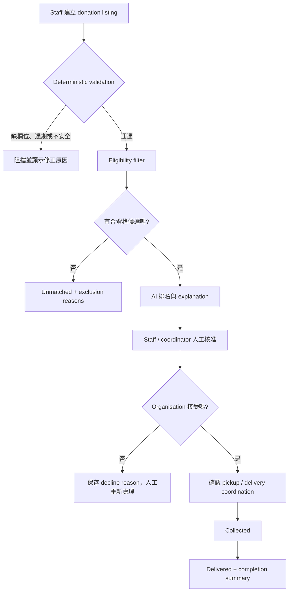

# FoodFlow 食物剩餘分流平台 MVP Feature Specification

> **狀態：** Proposed / Draft
> **文件用途：** 將 Woolworths NZ scenario brief 與 platform feature list 整理成下一階段可實作、可驗收的 MVP 規格。
> **建立日期：** 2026-08-08
> **證據狀態：** 本文件的現況描述來自已讀取的 Notion 頁面與目前 repository；產品行為、資料模型與 API 形狀標示為提案，尚未代表已完成實作。

## 1. 來源與文件邊界

本規格以以下兩份 Notion 文件為主要輸入：

- [Woolworths NZ Food Waste Diversion — Scenario Brief](https://app.notion.com/p/3b56c0b712f880c0b87cc01d2bec2d7f?pvs=204)
- [Woolworths Food Waste Platform Features](https://app.notion.com/p/3b56c0b712f8804b9e66c873d60af1cb?pvs=204)

本 repository 目前仍是 FoodFlow platform foundation：後端只有 `/health`，PostgreSQL 尚未建立 application tables，前端也只有 foundation screen。這些現況可由 [README.md](../README.md)、[backend/app/main.py](../backend/app/main.py)、[backend/app/database.py](../backend/app/database.py) 與 [frontend/src/app/page.tsx](../frontend/src/app/page.tsx) 確認。

文件中的證據標記如下：

| 標記 | 意義 |
| --- | --- |
| **已確認** | 來源頁面或目前 repository 明確寫出、且已讀取檢查的內容。 |
| **提案** | 為了讓 MVP 可實作而從來源推導的產品或技術決定，不應被當成 Woolworths 現行系統事實。 |
| **未確認** | 需要 Woolworths、StoreCentral 或 community organisation 訪談／系統存取才能決定的事項。 |

## 2. 問題與產品目標

### 2.1 已確認的背景

Scenario Brief 描述的現有流程是：Woolworths 員工在商品無法銷售後，以 StoreCentral 掃描，系統檢查是否可分流，提示 Food Recovery Hierarchy 中目前最高的可用選項，再通知當地 diversion partner，最後把分流結果送到 dashboard 與 store scorecard。

Food Recovery Hierarchy 的優先順序是：

1. **People**：捐給 food rescue partner，或 upcycle 成其他食品。
2. **Animals**：不適合人食但可作 animal feed 的食品。
3. **Nutrient recovery**：例如 compost、anaerobic digestion 或 vermicomposting。
4. **Landfill**：最後選項。

公開描述確認了掃描、資格檢查、層級提示、partner alert、追蹤與 dashboard，但沒有確認 alert 之後的完整閉環，包括 partner 是否接受、是否實際取貨、實際收取數量、最終用途，以及失敗後如何重新分流。

### 2.2 要解決的真正問題

> Woolworths store teams 需要一個能把 surplus food 配對到「適合且當下真的接得住」的 community organisation，並從人工核准一路追蹤到 collection / delivery 完成的協調層；單純發送 pickup alert 不能證明食品已被接受並在失去價值前完成分流。

這個產品不是另一個只負責列出 surplus food 的報表工具。MVP 的核心價值是把供給資料、組織需求與 capacity、時間限制、storage capability 和人工決策連成一條可追蹤的 operational workflow。

### 2.3 MVP 目標

MVP 要證明以下閉環可以在一個可重現的 prototype workflow 中完成：

1. Woolworths staff 建立結構化 donation listing。
2. 系統先用 deterministic rules 排除不合資格的組織。
3. AI 對剩餘候選人排序，並說明推薦原因。
4. Woolworths staff / coordinator 人工核准最終 match。
5. Community organisation 接受或拒絕，拒絕時留下原因。
6. 雙方看到 pickup / delivery 資訊與共同狀態。
7. 狀態從 `LISTED` 走到 `DELIVERED`，且最少能量化 rescued quantity 與 successful match count。

## 3. 角色與責任邊界

| 角色 | MVP 責任 | 權限邊界 |
| --- | --- | --- |
| Woolworths staff / coordinator | 建立 donation、查看推薦、核准 match、處理未配對或拒絕。 | AI 不代替其做最終 match 決策。 |
| Community organisation representative | 維護 profile、更新 needs / capacity、接受或拒絕 donation、確認收取／交付。 | 只能接受自身能力與服務範圍允許的食品。 |
| Matching system | 執行資格過濾、產生排名、提供 explanation、保存 workflow 狀態。 | 不得繞過 food-safety hard rules，也不得猜測缺失的 capacity。 |
| Delivery / pickup participant | 依 coordination 資訊完成取貨或配送，提供完成確認。 | MVP 不建立 volunteer driver marketplace；實際責任人和確認角色仍需確認。 |

## 4. Scope 決定

### 4.1 MVP 內含

| 能力 | MVP 行為 | 來源依據 |
| --- | --- | --- |
| Food Donation Listing | 輸入 food type、quantity、storage requirement、expiry / safe deadline、pickup window、location。 | Platform Features 的 Must Have |
| Community Organisation Profile | 記錄服務社群、接受的 food types、dietary restrictions、capacity、refrigeration、service area、operating hours。 | Platform Features 的 Must Have |
| Needs and Capacity Update | 組織更新目前需求、可收容量，以及今天是否能接收。 | Platform Features 的 Must Have |
| Eligibility filter | 先排除 storage、food category、capacity、時間或 service area 不符合的組織。 | Platform Features 的推薦 matching logic |
| AI Matching Recommendation | 從合資格候選中排名，至少回傳前三名（若不足則回傳所有合資格候選）。 | Platform Features 的 Must Have |
| Match Explanation | 顯示距離、storage、需求、capacity、時間等可追溯原因。 | Platform Features 的 Must Have |
| Human Approval | staff / coordinator 確認最終 match；大量或較高風險 donation 也不能自動核准。 | Platform Features 的 Must Have |
| Accept / Decline | organisation 明確接受或拒絕，拒絕必須選擇或輸入原因。 | Platform Features 的 Must Have |
| Pickup / Delivery Coordination | 顯示地址、contact、時間窗口與 delivery responsibility。 | Platform Features 的 Must Have |
| Status Tracking | 共享 `Listed → Matched → Accepted → Collected → Delivered` 進度。 | Platform Features 的 Must Have |
| Deterministic food-safety rules | 過期、缺少 critical information 或 storage 不安全時阻擋 listing / match；AI 不能覆寫。 | Platform Features 的 Must Have |
| Minimal impact summary | 在完成頁或簡單 summary 顯示 rescued quantity 與 successful match count。 | 對齊 prototype flow；完整 dashboard 另列後續 |

### 4.2 明確不放進本次 MVP

- 不取代 StoreCentral，也不假設 StoreCentral 已提供 API、event feed 或 partner capacity data。
- 不做 full route optimisation、跨多店配送規劃或即時車隊管理。
- 不做 natural-language listing、image recognition、demand forecasting 或 multi-language interface。
- 不做自動化的下一個 partner reroute。MVP 可讓 staff 重新查看候選或修正資料後再發起 match，但不自動承諾新的 partner。
- 不建立 volunteer driver marketplace。
- 不把 `Organisation Reliability Score`、dynamic fairness、carbon estimate 或完整 audit trail 當成核心流程的必要條件。

### 4.3 來源中需要明確解讀的地方

1. **Impact Dashboard 的分級不一致。** Feature list 把完整 Impact Dashboard 放在 Should Have，但 Recommended MVP Screens 又列出 Impact Dashboard。本規格採用折衷：MVP 只做 donation completion summary；可篩選、跨店比較、ESG 指標與趨勢圖表的完整 dashboard 延到下一階段。
2. **`Declined` 不在主狀態路徑中。** Donation lifecycle 仍使用 `Listed → Matched → Accepted → Collected → Delivered`；拒絕是獨立的 `MatchDecision`，保留拒絕原因後讓 donation 回到 `Listed` 或 `Unmatched`，避免把一次配對嘗試誤當成整個 donation 的終態。
3. **Brief 提到 rerouting，feature list 把 automated redistribution 列為 future。** 本規格以較保守的邊界為準：MVP 只記錄失敗與提供人工下一步，不自動改變 food 的責任鏈或目的地。

## 5. 代表性使用案例

以下是驗證 matching 行為的 illustrative case，不是 Woolworths 真實資料：

### 輸入

- Donation：20 箱冷藏 dairy，總重 25 kg。
- Store：Auckland 某店，pickup window 為 14:00–16:00。
- `expiry_at`：當日 18:00。
- Organisation A：接受 dairy、有 refrigeration、目前可收 30 kg、服務該區域、4 km 內可取貨。
- Organisation B：不具備 refrigeration。
- Organisation C：能收 dairy，但當日 capacity 已滿，且無法在 deadline 前取貨。

### 預期結果

1. Eligibility filter 保留 Organisation A。
2. Organisation B 因 storage capability 不符而排除。
3. Organisation C 因 capacity / time constraint 不符而排除。
4. AI 回傳 Organisation A 的推薦與可檢查的 explanation：能冷藏、目前有 dairy demand、有足夠 capacity、可在 pickup window 內完成取貨。
5. Staff 必須先核准；Organisation A 再接受後，donation 才能進入 `Accepted`。

如果沒有任何候選人通過 hard rules，系統回傳 `Unmatched` 與 exclusion reasons，不能以模糊的 AI 推測填補缺失資料。

## 6. 端到端流程與狀態模型



### 6.1 Donation lifecycle

| 狀態 | 進入條件 | 允許的下一步 |
| --- | --- | --- |
| `LISTED` | listing 通過基本輸入驗證。尚未有人核准 match。 | `MATCHED`、`UNMATCHED` |
| `MATCHED` | Woolworths staff / coordinator 核准一個推薦。 | `ACCEPTED`，或因組織拒絕而回到 `LISTED` / `UNMATCHED` |
| `ACCEPTED` | Community organisation 明確接受。 | `COLLECTED` |
| `COLLECTED` | 授權角色確認食品已被取走。 | `DELIVERED` |
| `DELIVERED` | 授權角色確認送達或由接收方完成接收。 | 完成；不可逆向回到進行中狀態 |
| `UNMATCHED` | 沒有合資格候選人，或所有 match attempts 都失敗。 | 由人工修正資料後重新開啟，或結束本次 donation |

`DECLINED` 不作為 donation 的 lifecycle status。每次 match attempt 另存 `PENDING`、`ACCEPTED` 或 `DECLINED` 與原因，讓系統保留拒絕歷史而不遺失 donation 本身的狀態。

### 6.2 不變條件

- 沒有通過 deterministic eligibility 的 organisation，不得進入可供人工核准的候選清單。
- 沒有 staff / coordinator approval，不得進入 `Accepted`。
- 沒有 organisation acceptance，不得進入 `Collected`。
- 沒有 collection confirmation，不得進入 `Delivered`。
- 每一次狀態轉換都要留下 actor、時間、前一狀態、後一狀態與必要原因；同一個 action 重試不應重複建立狀態結果。

## 7. Matching 行為規格

### 7.1 三階段流程

```text
match(donation, organisation_snapshot):
    validate donation fields and food-safety rules
    eligible = filter organisations by hard constraints
    ranked = rank eligible organisations by configured matching factors
    return top three ranked candidates with reason codes and explanation
```

### 7.2 Hard constraints

以下條件是資格過濾，不是可由 AI 用高分抵銷的偏好：

- 具備 donation 所需的 refrigeration / storage capability。
- 接受該 food category，且沒有不相容的 dietary restriction。
- 有足夠的當前 capacity。
- 能在 expiry 或 safe collection deadline 前接收。
- 位於 service area 內，且能配合 pickup / delivery window。
- Donation 的 critical fields 完整，且未過期或違反 food-safety policy。

### 7.3 Ranking factors

合資格候選的排序可考慮：

- current demand 與 food suitability；
- time compatibility 與距離 safe deadline 的餘裕；
- available capacity；
- distance / travel practicality；
- expected distribution impact。

來源沒有提供權重，因此 MVP 必須把初始權重或排序順序明確寫成可測試的 configuration，而不是藏在 prompt 裡。**精確權重是未確認的產品決策**；在沒有 owner 指定前，應優先保證 hard constraints、expiry urgency 和 explanation 可驗證，再調整 ranking quality。

### 7.4 AI 邊界

- AI 只負責候選排序與自然語言 explanation；最終核准由 human 完成。
- AI 的輸入只來自結構化 donation 與 organisation data，不可自行假設需求、capacity、storage 或可用時間。
- Food-safety hard rules 由 deterministic domain policy 執行。
- 若資料缺失或規則衝突，回傳「需要人工處理」與具體原因，不生成看似確定的推薦。

## 8. Proposed MVP data contract

以下是下一個 implementation phase 的最小資料形狀，屬於**提案**。目前 database 尚無 application schema，不能表述成現有 contract。

### 8.1 `Donation`

| 欄位 | 必填 | 說明 |
| --- | --- | --- |
| `id` | 是 | Donation identifier。 |
| `store_id` / `location` | 是 | 來源店點與 pickup location。 |
| `food_type` / `food_category` | 是 | 食品類型與 matching category。 |
| `quantity` / `unit` | 是 | 數量及單位；要能換算至 impact summary 所需的重量或數量。 |
| `storage_requirement` | 是 | 常溫、冷藏、冷凍或其他已支援類型。 |
| `expiry_at` | 是 | 食品有效期限或明確的 safe deadline。實際 policy 來源仍需確認。 |
| `pickup_window_start` / `pickup_window_end` | 是 | 可取貨時間窗口。 |
| `destination_type` | 完成時 | Food Recovery Hierarchy 的最終目的地：`PEOPLE`、`ANIMALS`、`NUTRIENT_RECOVERY` 或 `LANDFILL`。 |
| `status` | 是 | Donation lifecycle enum。 |
| `created_by` / `created_at` | 是 | 建立者與時間。 |

### 8.2 `OrganisationProfile` 與 `OrganisationAvailability`

`OrganisationProfile` 保存相對穩定的能力：

- organisation name、communities served；
- accepted food categories、dietary restrictions；
- refrigeration / storage capabilities；
- service area、operating hours。

`OrganisationAvailability` 保存會變動的狀態：

- current needs；
- available capacity；
- `can_accept_today`；
- 更新時間與有效期間。

Profile 與 availability 必須分開，避免把「通常有 refrigeration」誤當成「今天仍有 capacity」。

### 8.3 `MatchAttempt`、`Delivery` 與狀態事件

- `MatchAttempt`：保存 donation、organisation、rank、是否通過 eligibility、exclusion / reason codes、explanation、產生時間，以及 organisation 的 accept / decline decision。
- `Delivery`：保存 pickup address、contact、window、delivery responsibility，以及 collection / delivery confirmation。
- `DonationStatusEvent`：保存每次狀態轉換的 actor、timestamp、previous status、new status、reason。這是完成 lifecycle 的最低可追蹤性，不等同於下一階段的完整 audit trail。

## 9. 建議的 service flow 與 API 邊界

目前只有 `/health`，下列 HTTP surface 是後續實作的**提案**，不是既有 API contract：

| 用途 | 建議操作 | 主要規則 |
| --- | --- | --- |
| 建立 donation | `POST /api/donations` | 驗證欄位、expiry 與 storage requirement；建立 `LISTED`。 |
| 取得推薦 | `GET /api/donations/{id}/matches` | 執行或讀取 eligibility filter 與排名結果；回傳 explanation。 |
| 核准 match | `POST /api/donations/{id}/match-approval` | 僅 Woolworths staff / coordinator 可執行；轉為 `MATCHED`。 |
| 組織回應 | `POST /api/matches/{id}/decision` | 接受轉 `ACCEPTED`；拒絕必須保存 reason。 |
| 更新 logistics / 狀態 | `POST /api/donations/{id}/status-events` | 只允許合法、單調的 lifecycle transition。 |
| 維護組織資料 | `GET/PATCH /api/organisations/{id}` | 分別管理 profile 與 current availability。 |

建議的後端資料流是：

1. Route 解析 request 並驗證輸入格式。
2. Service 載入 donation 與 organisation snapshot。
3. Domain policy 執行 food-safety 與 eligibility hard rules。
4. Matching service 對合資格候選排序並建立 reason codes。
5. Repository 儲存 listing、match attempt 與必要狀態事件。
6. Route 把 typed result 映射成 API response；前端只依 response 更新畫面。

StoreCentral integration 應在此流程外包成 future adapter。MVP 先允許表單手動建立 donation；等 API / event feed 可用且資料欄位對齊後，才增加上游輸入 adapter。

## 10. MVP 畫面

來源 feature list 建議的 prototype screens 可收斂為：

1. **Donation Form**：建立並驗證 surplus food listing。
2. **Community Organisation Profile**：查看或維護 profile 與 availability。
3. **AI Match Results**：顯示前三名、排除原因與推薦 explanation。
4. **Match Confirmation**：staff 核准，organisation 接受或拒絕。
5. **Delivery Status**：查看 pickup / delivery details 與 lifecycle。
6. **Completion Summary**：先顯示單筆或簡單累計的 rescued quantity、successful match count；完整 Impact Dashboard 延後。

## 11. Acceptance criteria 與測試對應

| Acceptance criterion | 最小驗證 |
| --- | --- |
| 必填 donation data 能建立 `LISTED`，缺失欄位不能建立。 | API validation test；包含 quantity、storage、expiry、pickup window、location。 |
| 過期、不安全或資料不完整的 donation 被 deterministic rules 阻擋。 | Domain policy unit tests；確認 AI / human recommendation 不能繞過 hard fail。 |
| 不合資格的 organisation 不會出現在可核准候選中。 | Eligibility tests：storage、category、capacity、deadline、service area 各一個案例。 |
| 合資格候選最多回傳前三名，且每個候選都有可追溯 explanation。 | Matching service test；固定 snapshot 後驗證排序、rank、reason codes。 |
| 沒有 staff approval 時，organisation 不能直接把 donation 變成 `ACCEPTED`。 | Permission / workflow integration test。 |
| Organisation decline 必須帶原因，且不會把 donation 錯誤標為 accepted。 | Match decision test；驗證 `MatchAttempt` 歷史保留。 |
| 只能按 `LISTED → MATCHED → ACCEPTED → COLLECTED → DELIVERED` 合法推進。 | State transition tests；拒絕、重試、重複 request 與跳級都要覆蓋。 |
| Completion summary 只在完成狀態使用已儲存的 rescued quantity / match count。 | API / selector test；確認不使用未完成或重複事件計算。 |
| 目前 foundation 的 `/health` 與空 database smoke test 仍保持通過。 | Existing backend tests；新 feature migration 後更新「空表」測試的預期。 |

## 12. Success measures

Scenario Brief 建議的 outcome metrics 可分為 operational、food outcome 與 network consistency 三組。來源沒有提供數值 target，因此第一個 implementation phase 只定義事件與計算口徑，不自行填入成功門檻。

| 指標 | 建議定義 |
| --- | --- |
| Pickup alert / match acceptance rate | 被 organisation 明確接受的 match 數 ÷ 發出的 match 數。 |
| On-time completion rate | 在 pickup window 內完成 collection 的 accepted donation 比例。 |
| Scan / listing to acceptance time | `listed_at` 到 `accepted_at` 的時間。MVP 手動輸入時以 `created_at` 作為暫時起點。 |
| Listing to collection time | `created_at` 到 `collected_at` 的時間。 |
| Food-to-people rate | 被記錄為 People route 的 edible quantity ÷ edible surplus quantity。需要 destination taxonomy 與重量口徑確認。 |
| Failed match / unmatched rate | 無合資格候選或被拒絕後未完成的 donation 比例。 |
| Staff coordination time | 每筆 donation 在人工處理上花費的時間；需要 UI event 或人工量測方式。 |
| Network landfill-diversion rate | 全部 stores 的 landfill diversion，不只 top-performing stores。 |
| Store variance | 各 store diversion performance 的分布，而非只報告最高值。 |

## 13. 未確認事項與下一輪 owner decision

這些問題會直接影響 data model、workflow 或 success criteria，應在 implementation planning 前確認：

| 未確認事項 | 為什麼會改變實作 | 暫定 MVP 做法 |
| --- | --- | --- |
| StoreCentral 是否已有 acceptance / completed pickup data？ | 決定是建立新流程，還是只補上既有事件的視圖。 | 先以 manual listing 與 manual status event 驗證閉環。 |
| StoreCentral 是否能提供 API / event feed？ | 決定 integration adapter、auth 與同步策略。 | 不在 MVP 假設可連接；保留 future adapter 邊界。 |
| `expiry_at`、`use-by` 與 safe collection deadline 的政策關係？ | 影響是否能安全地計算 deadline。 | 先把 safety policy 變成 deterministic configuration，未確認前不讓 AI 推測。 |
| 誰能確認 `Collected` 與 `Delivered`？ | 影響角色權限與 evidence of completion。 | 先允許明確授權的 coordinator / receiving organisation actor；正式責任人需確認。 |
| Organisation capacity 更新頻率與可信度？ | 影響 stale data、候選排名與失敗率。 | availability 帶 `updated_at` / validity；超時資料不應直接視為 current。 |
| Matching factors 的初始權重？ | 影響推薦排序與測試 fixture。 | 先用可配置、可測試的排序規則；不要把權重藏進不可觀察的 prompt。 |
| Food category、unit 與 quantity 的標準？ | 影響 eligibility、重量統計與跨組織比較。 | MVP 先限制到明確支援的 enum / units，完整 taxonomy 需 owner 決定。 |
| MVP 的 acceptance-rate、on-time 與 food-to-people target？ | 沒有 target 只能驗證流程，不能判定 business success。 | 先收集 baseline，再設定 pilot threshold。 |

## 14. 下一個 implementation phase 的完成條件

下一階段只有在以下條件都成立時，才算完成 MVP vertical slice：

- donation、organisation profile、availability、match attempt 與 lifecycle event 的 schema 已定義並可持久化；
- 代表性 case 的 eligibility、ranking、explanation、human approval、decline 與 delivery transition 都有測試；
- API response、service state change 與前端畫面使用同一套 status / field contract；
- food-safety hard rules 不依賴 LLM 判斷；
- 至少一個 donation 可從建立一路走到 `DELIVERED`，並能說明每個狀態變化的 actor 與時間；
- 沒有誤把 StoreCentral integration、real-time partner capacity 或 network-wide 90% diversion 當成已存在的系統能力。

## Sources

主要來源：

1. [Woolworths NZ Food Waste Diversion — Scenario Brief](https://app.notion.com/p/3b56c0b712f880c0b87cc01d2bec2d7f?pvs=204)
2. [Woolworths Food Waste Platform Features](https://app.notion.com/p/3b56c0b712f8804b9e66c873d60af1cb?pvs=204)

Scenario Brief 內引用的公開資料如下；本規格保留這些連結作為上游 evidence trail，但沒有在本次工作中重新驗證其內容：

- [Kai Commitment — Woolworths StoreCentral case study](https://kaicommitment.org.nz/mp-files/woolworths-store-central-case-study.pdf/)
- [Kai Commitment — Woolworths: Streamlining food waste diversion](https://kaicommitment.org.nz/woolworths-streamlining-food-waste-diversion/)
- [GS1 New Zealand — Woolworths NZ cuts food waste with 2D barcodes](https://www.gs1nz.org/member-stories/woolworths-nz-2d-barcodes)
- [KiwiHarvest — Woolworths Food Rescue Mission](https://www.kiwiharvest.org.nz/videos)
- [KiwiHarvest — Frequently Asked Questions](https://www.kiwiharvest.org.nz/faqs)
- [KiwiHarvest — Current food rescue scale](https://www.kiwiharvest.org.nz/)
